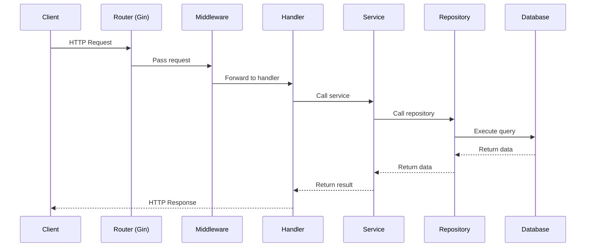

# Book Rental System API Sequence Diagrams

This document contains sequence diagrams describing the API flow in the Book Rental System.

## Table of Contents

- [System Overview](#system-overview)
- [General API Flow](#general-api-flow)
- [Authentication API](#authentication-api)
- [User API](#user-api)
- [Category API](#category-api)
- [Book API](#book-api)
- [Rental API](#rental-api)
- [Payment API](#payment-api)
- [Report API](#report-api)

## System Overview

See the system architecture overview diagram [here](./system-overview.md). This provides a comprehensive view of how different components interact with each other.

## General API Flow

See the general API flow diagram [here](./general-api-flow.md).

## Authentication API

See the authentication API diagrams [here](./auth-api-flow.md).

- `POST /api/v1/auth/register` - Register a new user
- `POST /api/v1/auth/login` - User login
- `POST /api/v1/auth/refresh` - Refresh token
- `POST /api/v1/auth/logout` - User logout

## User API

See the user API diagrams [here](./user-api-flow.md).

- `GET /api/v1/users` - Get all users (admin only)
- `GET /api/v1/users/:id` - Get user by ID
- `PUT /api/v1/users/:id` - Update user information
- `DELETE /api/v1/users/:id` - Delete user (admin only)

## Category API

See the category API diagrams [here](./category-api-flow.md).

- `GET /api/v1/categories` - Get paginated categories
- `GET /api/v1/categories/all` - Get all categories
- `GET /api/v1/categories/:id` - Get category by ID
- `POST /api/v1/categories` - Create a new category (admin/librarian only)
- `PUT /api/v1/categories/:id` - Update category (admin/librarian only)
- `DELETE /api/v1/categories/:id` - Delete category (admin/librarian only)

## Book API

See the book API diagrams [here](./book-api-flow.md).

- `GET /api/v1/books` - Get paginated books
- `GET /api/v1/books/search` - Search books
- `GET /api/v1/books/category/:id` - Get books by category
- `GET /api/v1/books/:id` - Get book by ID
- `POST /api/v1/books` - Add a new book (admin/librarian only)
- `PUT /api/v1/books/:id` - Update book (admin/librarian only)
- `PUT /api/v1/books/:id/copies` - Update book copies (admin/librarian only)
- `DELETE /api/v1/books/:id` - Delete book (admin/librarian only)

## Rental API

See the rental API diagrams [here](./rental-api-flow.md).

- `GET /api/v1/rentals` - Get all rentals (admin/librarian only)
- `GET /api/v1/rentals/user/:userId` - Get user rentals
- `GET /api/v1/rentals/:id` - Get rental by ID
- `POST /api/v1/rentals` - Create a new rental
- `PUT /api/v1/rentals/:id/return` - Process book return
- `PUT /api/v1/rentals/:id/extend` - Extend rental period

## Payment API

See the payment API diagrams [here](./payment-api-flow.md).

- `GET /api/v1/payments` - Get all payments (admin only)
- `GET /api/v1/payments/user/:userId` - Get user payments
- `GET /api/v1/payments/:id` - Get payment by ID
- `POST /api/v1/payments` - Create a new payment
- `POST /api/v1/payments/process` - Process payment
- `PUT /api/v1/payments/:id/refund` - Refund payment (admin/librarian only)

## Report API

See the report API diagrams [here](./report-api-flow.md).

- `GET /api/v1/reports/books/popular` - Get popular books report
- `GET /api/v1/reports/revenue` - Get revenue report (admin only)
- `GET /api/v1/reports/overdue` - Get overdue books report
