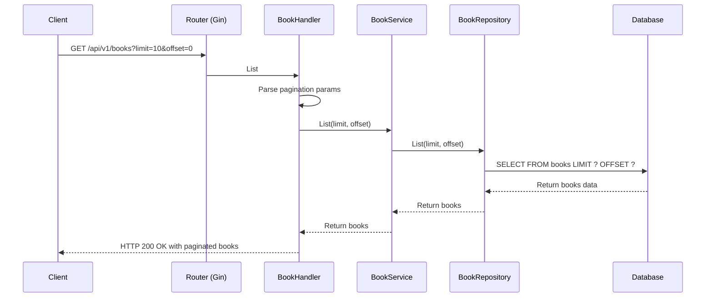
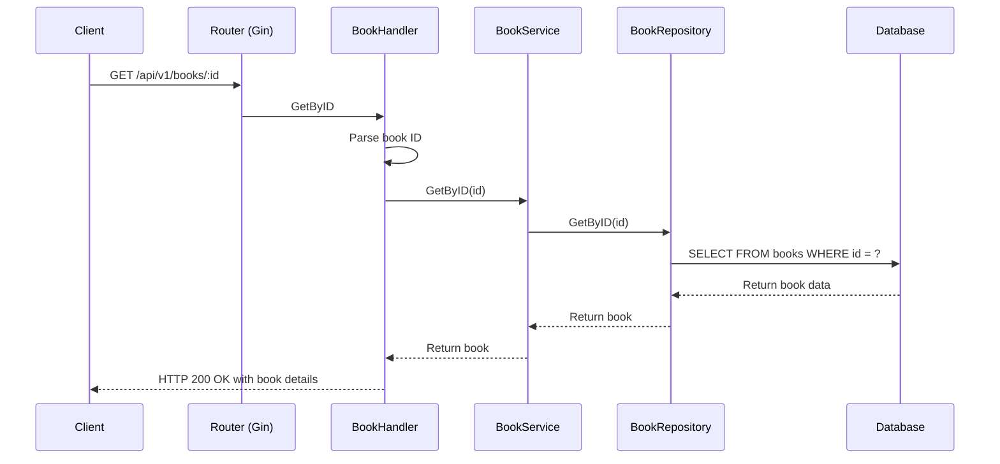
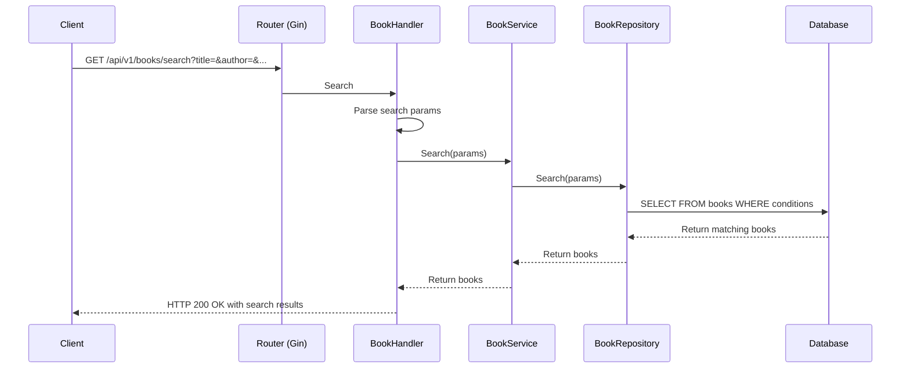
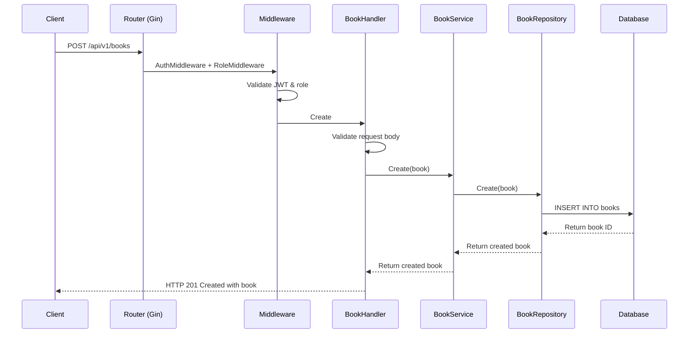
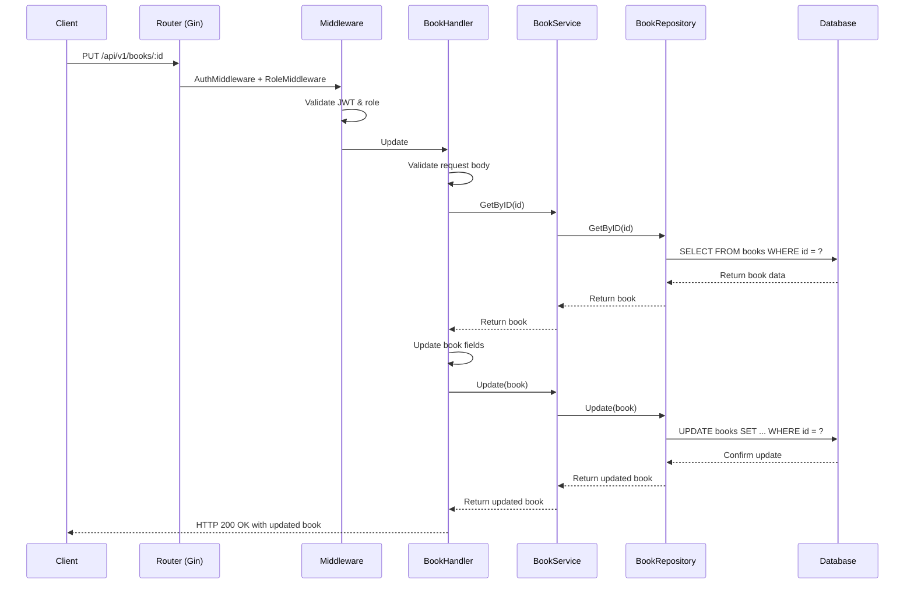
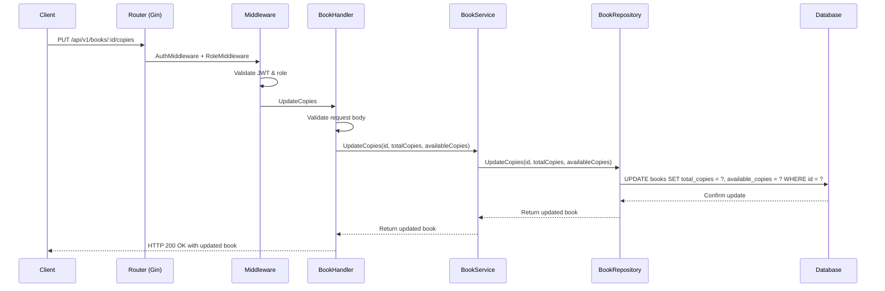

# Book API Flow Sequence Diagrams

## List Books Flow



## Get Book By ID Flow



## Search Books Flow



## Create Book Flow



## Update Book Flow



## Update Book Copies Flow



## Delete Book Flow

```mermaid
sequenceDiagram
    participant C as Client
    participant R as Router (Gin)
    participant M as Middleware
    participant H as BookHandler
    participant S as BookService
    participant BR as BookRepository
    participant DB as Database

    C->>R: DELETE /api/v1/books/:id
    R->>M: AuthMiddleware + RoleMiddleware
    M->>M: Validate JWT & role
    M->>H: Delete
    H->>H: Parse book ID
    H->>S: Delete(id)
    S->>BR: Delete(id)
    BR->>DB: DELETE FROM books WHERE id = ?
    DB-->>BR: Confirm delete
    BR-->>S: Return success
    S-->>H: Return success
    H-->>C: HTTP 200 OK with success message
