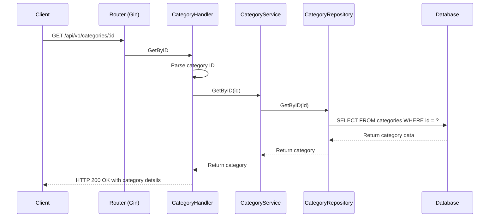
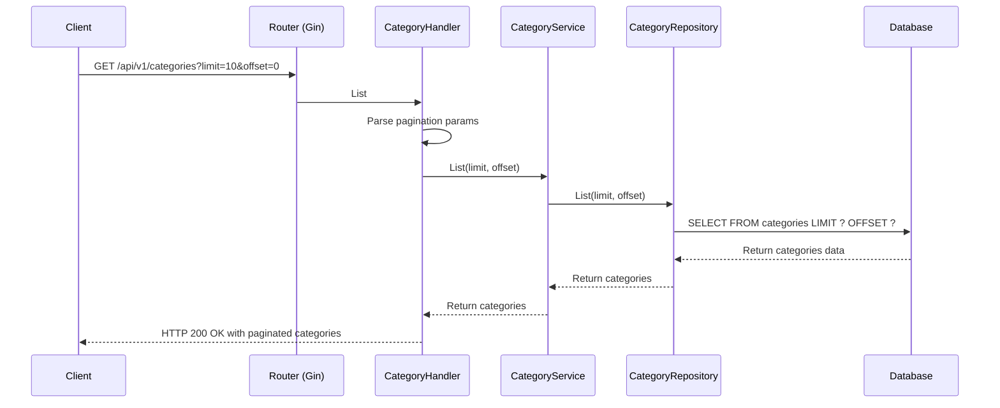
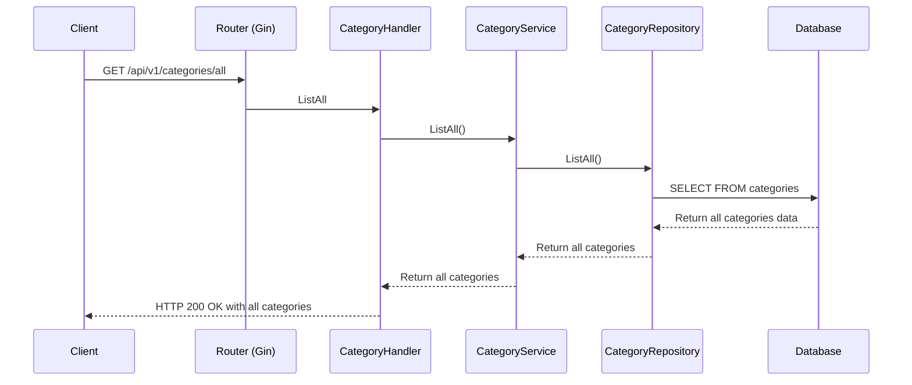
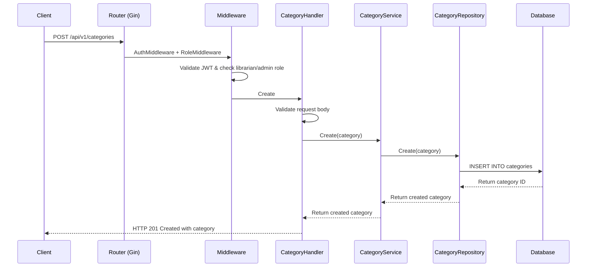
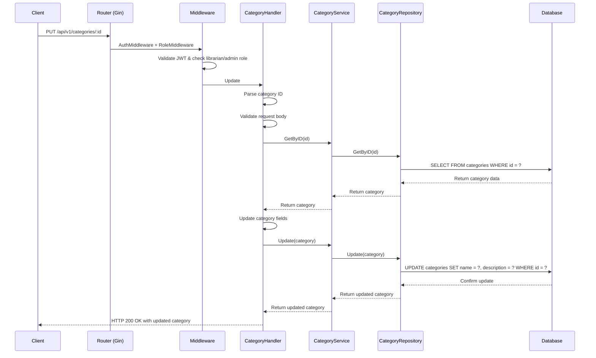

# Category API Flow Sequence Diagrams

## Get Category By ID Flow



## List Categories Flow



## List All Categories Flow



## Create Category Flow



## Update Category Flow



## Delete Category Flow

```mermaid
sequenceDiagram
    participant C as Client
    participant R as Router (Gin)
    participant M as Middleware
    participant H as CategoryHandler
    participant S as CategoryService
    participant CR as CategoryRepository
    participant DB as Database

    C->>R: DELETE /api/v1/categories/:id
    R->>M: AuthMiddleware + RoleMiddleware
    M->>M: Validate JWT & check librarian/admin role
    M->>H: Delete
    H->>H: Parse category ID
    H->>S: Delete(id)
    S->>CR: Delete(id)
    CR->>DB: DELETE FROM categories WHERE id = ?
    DB-->>CR: Confirm delete
    CR-->>S: Return success
    S-->>H: Return success
    H-->>C: HTTP 200 OK with success message
