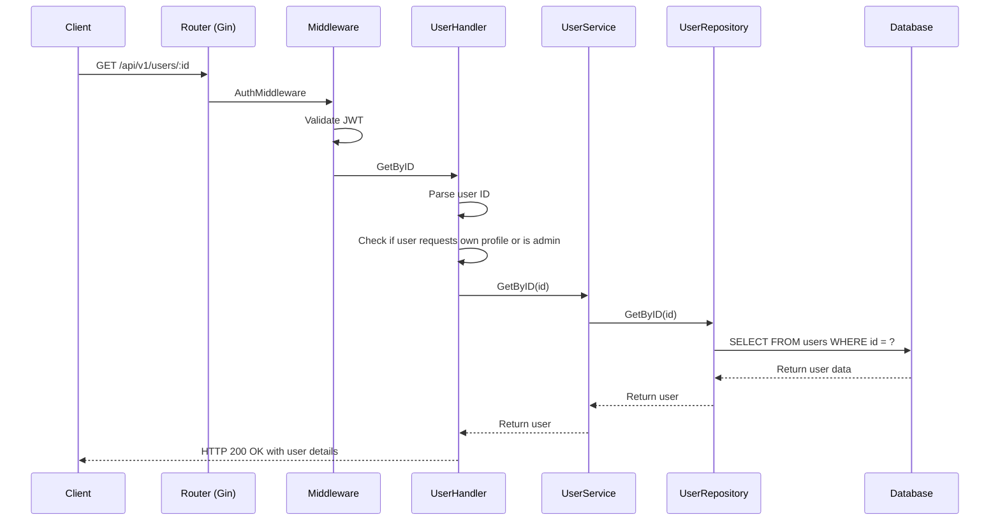
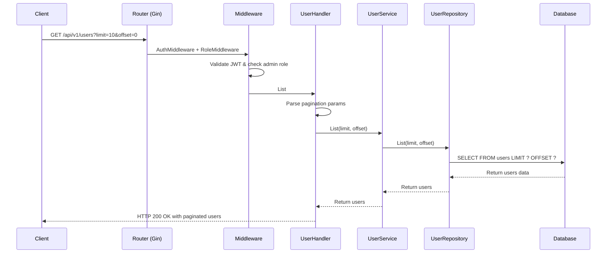
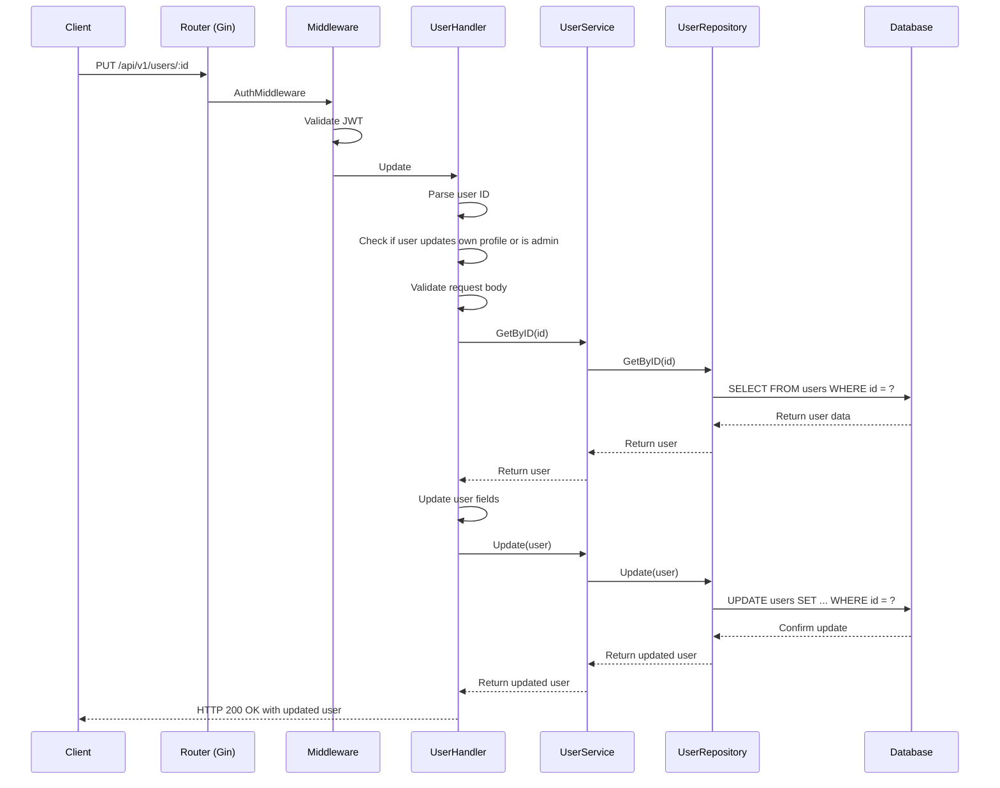

# User API Flow Sequence Diagrams

## Get User By ID Flow



## List Users Flow (Admin Only)



## Update User Flow



## Delete User Flow (Admin Only)

```mermaid
sequenceDiagram
    participant C as Client
    participant R as Router (Gin)
    participant M as Middleware
    participant H as UserHandler
    participant S as UserService
    participant UR as UserRepository
    participant DB as Database

    C->>R: DELETE /api/v1/users/:id
    R->>M: AuthMiddleware + RoleMiddleware
    M->>M: Validate JWT & check admin role
    M->>H: Delete
    H->>H: Parse user ID
    H->>S: Delete(id)
    S->>UR: Delete(id)
    UR->>DB: DELETE FROM users WHERE id = ?
    DB-->>UR: Confirm delete
    UR-->>S: Return success
    S-->>H: Return success
    H-->>C: HTTP 200 OK with success message
