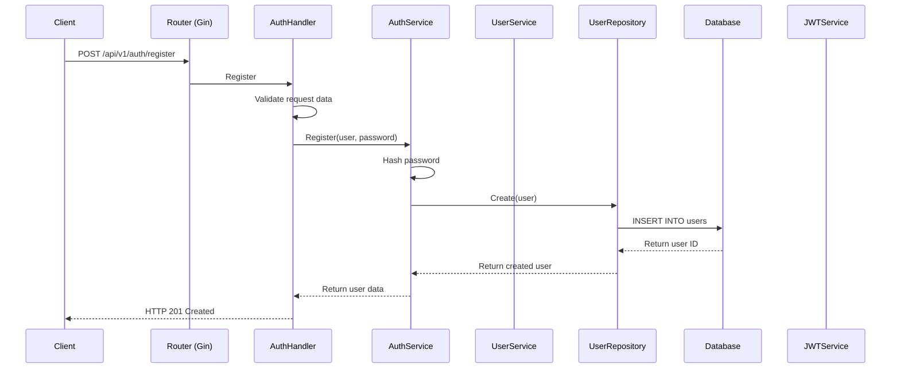
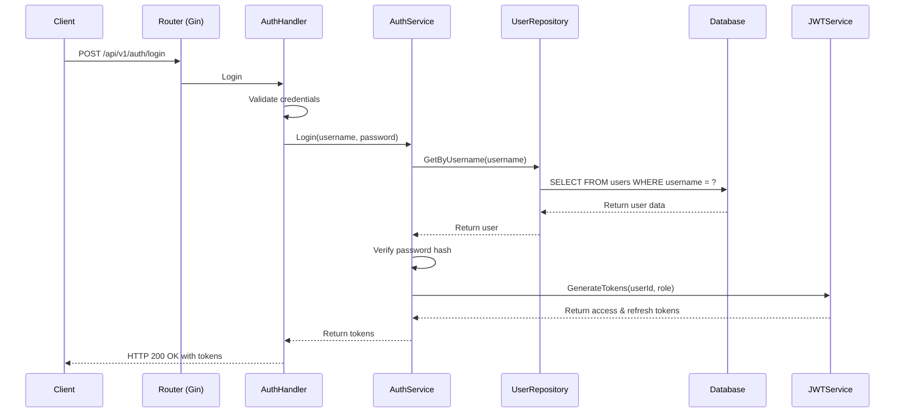
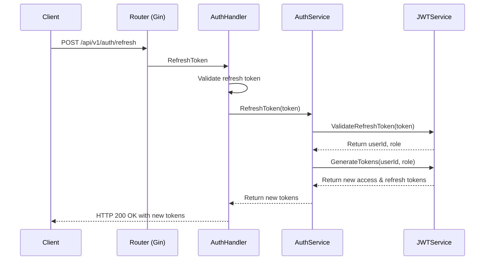

# Auth API Flow Sequence Diagrams

## Register Flow



## Login Flow



## Refresh Token Flow



## Logout Flow

```mermaid
sequenceDiagram
    participant C as Client
    participant R as Router (Gin)
    participant M as Middleware
    participant H as AuthHandler
    participant S as AuthService
    participant JWT as JWTService

    C->>R: POST /api/v1/auth/logout
    R->>M: AuthMiddleware
    M->>M: Validate JWT
    M->>H: Logout
    H->>S: Logout(token)
    S->>JWT: InvalidateToken(token)
    JWT-->>S: Confirm invalidation
    S-->>H: Return success
    H-->>C: HTTP 200 OK
