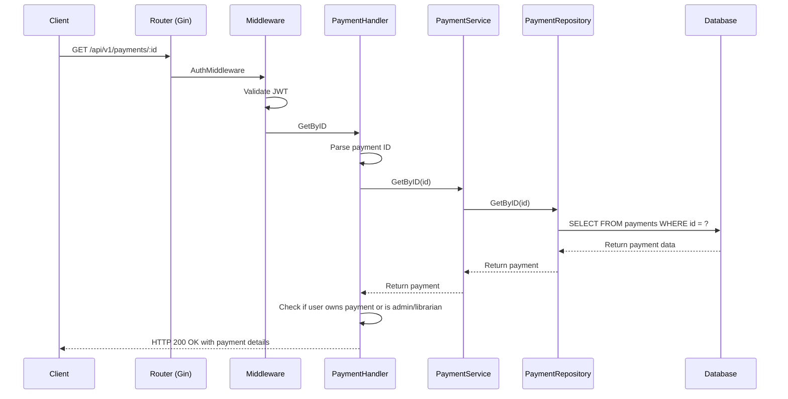
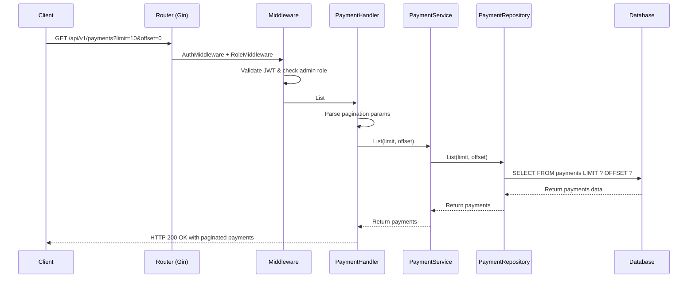
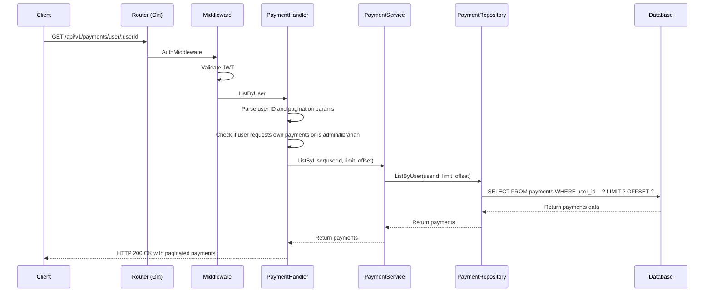
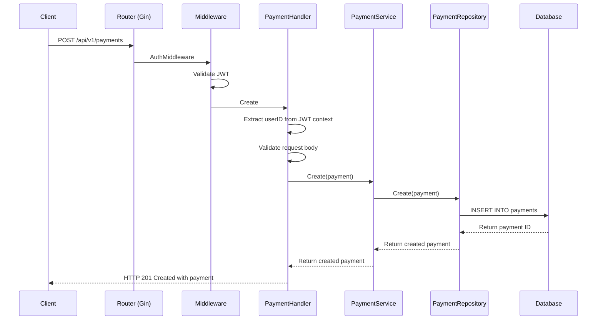
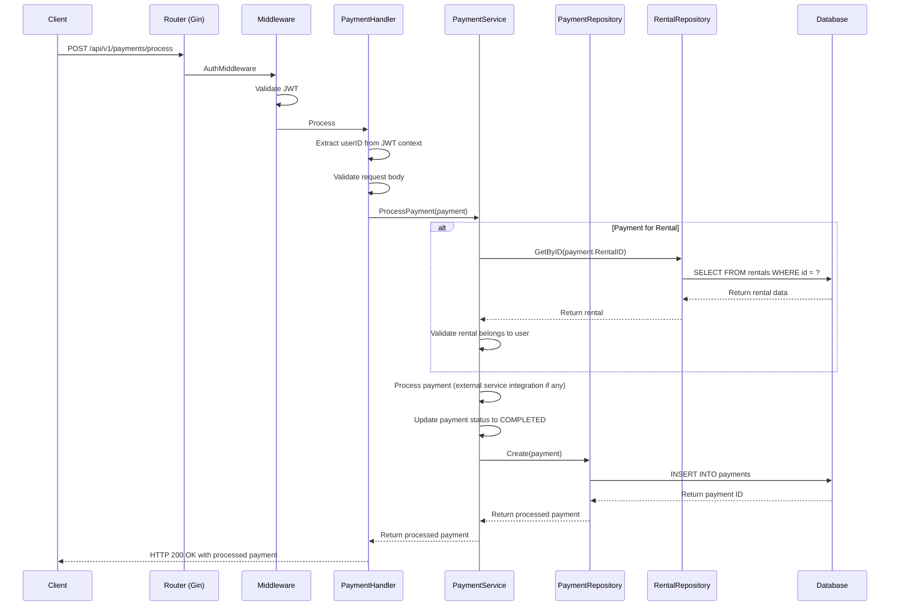

# Payment API Flow Sequence Diagrams

## Get Payment By ID Flow



## List Payments Flow (Admin/Librarian)



## List User Payments Flow



## Create Payment Flow



## Process Payment Flow



## Refund Payment Flow

```mermaid
sequenceDiagram
    participant C as Client
    participant R as Router (Gin)
    participant M as Middleware
    participant H as PaymentHandler
    participant S as PaymentService
    participant PR as PaymentRepository
    participant DB as Database

    C->>R: PUT /api/v1/payments/:id/refund
    R->>M: AuthMiddleware + RoleMiddleware
    M->>M: Validate JWT & check librarian/admin role
    M->>H: Refund
    H->>H: Parse payment ID
    H->>S: RefundPayment(id)
    S->>PR: GetByID(id)
    PR->>DB: SELECT FROM payments WHERE id = ?
    DB-->>PR: Return payment data
    PR-->>S: Return payment
    S->>S: Validate payment can be refunded
    S->>S: Process refund (external service integration if any)
    S->>S: Update payment status to REFUNDED
    S->>PR: Update(payment)
    PR->>DB: UPDATE payments SET status = 'refunded' WHERE id = ?
    DB-->>PR: Confirm update
    PR-->>S: Return refunded payment
    S-->>H: Return refunded payment
    H-->>C: HTTP 200 OK with refunded payment
