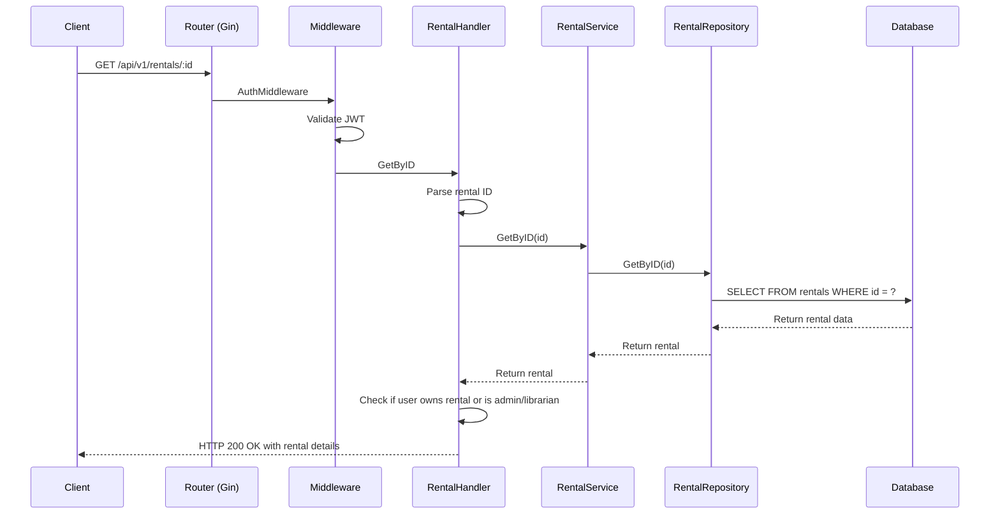
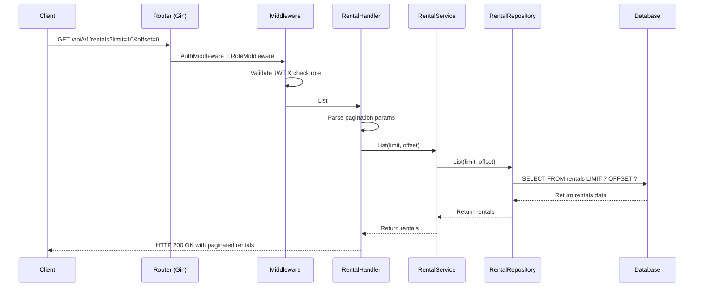
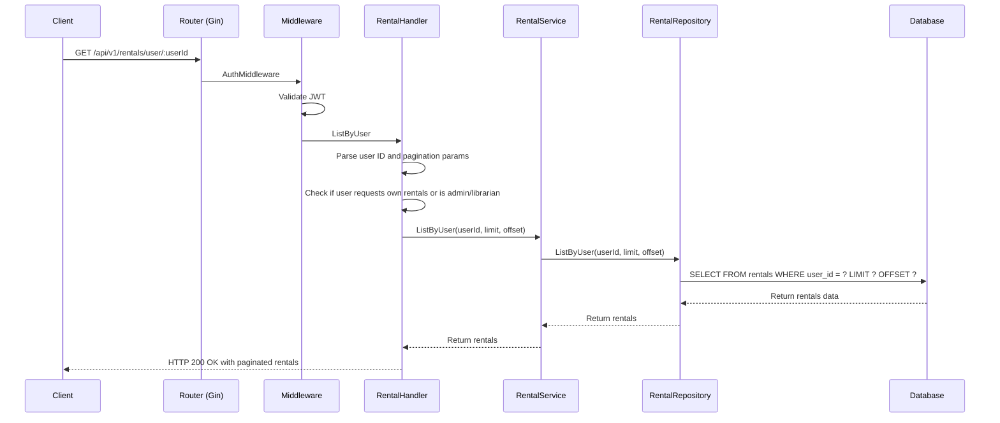
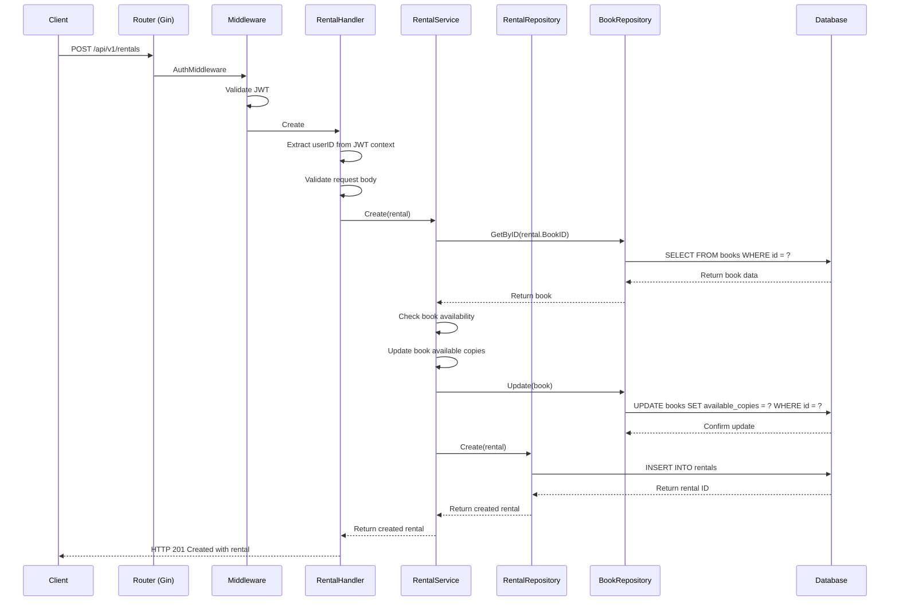
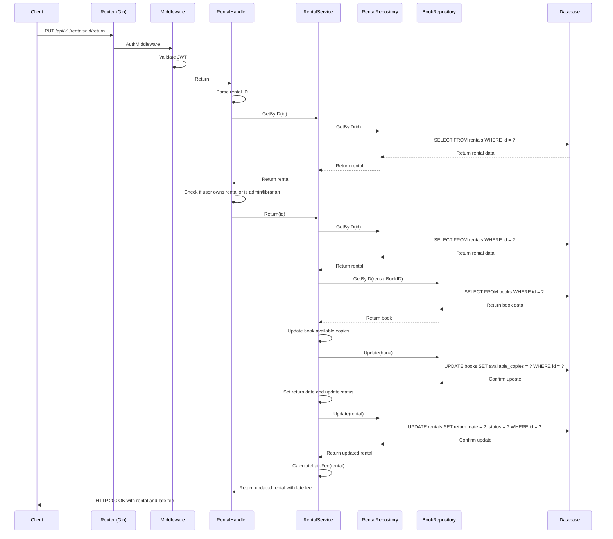

# Rental API Flow Sequence Diagrams

## Get Rental By ID Flow



## List Rentals Flow (Admin/Librarian)



## List User Rentals Flow



## Create Rental Flow



## Return Rental Flow



## Extend Rental Flow

```mermaid
sequenceDiagram
    participant C as Client
    participant R as Router (Gin)
    participant M as Middleware
    participant H as RentalHandler
    participant S as RentalService
    participant RR as RentalRepository
    participant DB as Database

    C->>R: PUT /api/v1/rentals/:id/extend
    R->>M: AuthMiddleware
    M->>M: Validate JWT
    M->>H: Extend
    H->>H: Parse rental ID
    H->>S: GetByID(id)
    S->>RR: GetByID(id)
    RR->>DB: SELECT FROM rentals WHERE id = ?
    DB-->>RR: Return rental data
    RR-->>S: Return rental
    S-->>H: Return rental
    H->>H: Check if user owns rental or is admin/librarian
    H->>H: Validate request body (days to extend)
    H->>S: Extend(id, days)
    S->>RR: GetByID(id)
    RR->>DB: SELECT FROM rentals WHERE id = ?
    DB-->>RR: Return rental data
    RR-->>S: Return rental
    S->>S: Check if rental can be extended
    S->>S: Calculate new due date
    S->>RR: Update(rental)
    RR->>DB: UPDATE rentals SET due_date = ? WHERE id = ?
    DB-->>RR: Confirm update
    RR-->>S: Return updated rental
    S-->>H: Return updated rental
    H-->>C: HTTP 200 OK with updated rental
