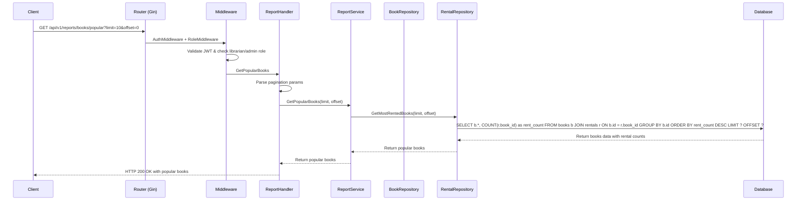
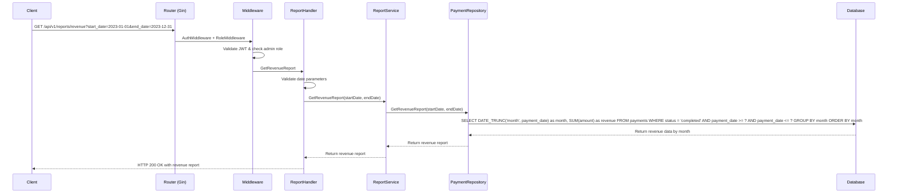

# Report API Flow Sequence Diagrams

## Get Popular Books Report Flow



## Get Revenue Report Flow



## Get Overdue Books Report Flow

```mermaid
sequenceDiagram
    participant C as Client
    participant R as Router (Gin)
    participant M as Middleware
    participant H as ReportHandler
    participant S as ReportService
    participant RR as RentalRepository
    participant BR as BookRepository
    participant UR as UserRepository
    participant DB as Database

    C->>R: GET /api/v1/reports/overdue?limit=10&offset=0
    R->>M: AuthMiddleware + RoleMiddleware
    M->>M: Validate JWT & check librarian/admin role
    M->>H: GetOverdueBooks
    H->>H: Parse pagination params
    H->>S: GetOverdueBooks(limit, offset)
    S->>RR: GetOverdueRentals(limit, offset)
    RR->>DB: SELECT r.*, b.title, u.username FROM rentals r JOIN books b ON r.book_id = b.id JOIN users u ON r.user_id = u.id WHERE r.status = 'active' AND r.due_date < CURRENT_TIMESTAMP LIMIT ? OFFSET ?
    DB-->>RR: Return overdue rentals data
    RR-->>S: Return overdue rentals
    S-->>H: Return overdue rentals
    H-->>C: HTTP 200 OK with overdue books
