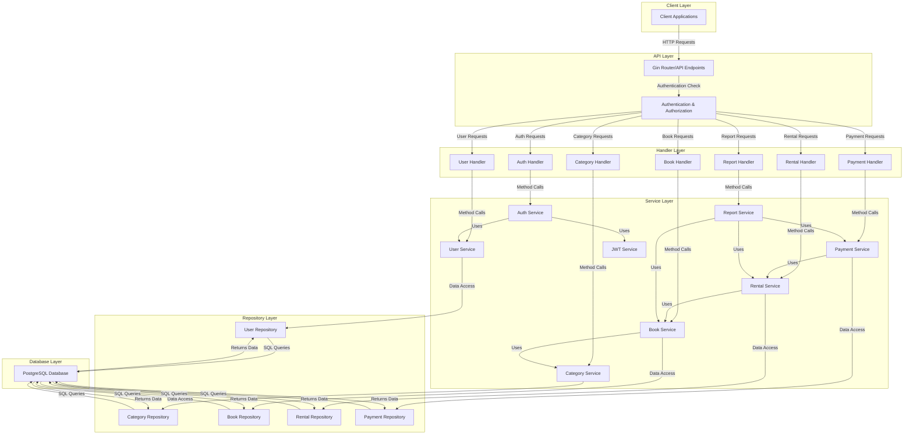

# Book Rental System - System Overview

This diagram provides a comprehensive view of the Book Rental System architecture, showing how different components interact with each other.

## Architectural Patterns

The Book Rental System implements:

1. **Clean Architecture** - Separating concerns with distinct layers:
   - External interfaces (API)
   - Business rules (Services)
   - Data access (Repositories)

2. **Dependency Injection** - Each layer receives its dependencies through constructors

3. **Repository Pattern** - Abstracting data access logic

4. **Service Layer Pattern** - Encapsulating business logic

5. **Middleware Pattern** - For cross-cutting concerns like authentication and logging

## Data Flow

1. Client makes HTTP request to API endpoints
2. Middleware processes authentication and authorization
3. Handler receives validated request
4. Handler calls appropriate Service methods
5. Service implements business logic
6. Service calls Repository methods for data access
7. Repository executes database operations
8. Data flows back up through the layers
9. Handler formats response
10. Client receives HTTP response

This architecture ensures separation of concerns, maintainability, and testability of the system.
